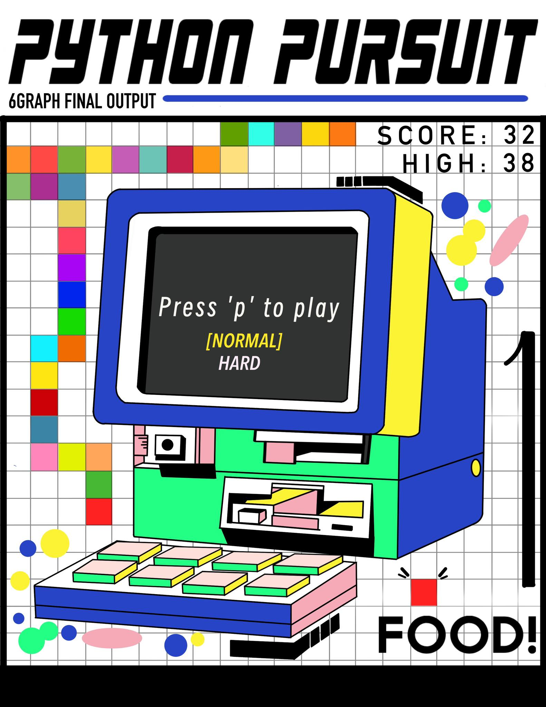

# Python Pursuit #
<div align="center">
    
</div>
A simple game written in <i>Python</i>, utilizing <i>Graphics.py</i> library. It is based on the classic Snake game with its own features.

This game is a group project for <b>6GRAPH</b> in final semester on Academic year 2022-2023.

# How to Run #
1. Open the <b>cmd</b> in this directory.
2. Install the requirements:
```
pip install -r requirements.txt
```
3. Run the program through <b>main.py</b>.
```
py main.py
```